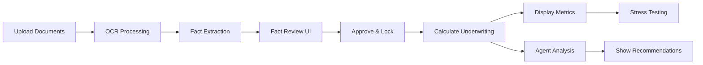

# Deal-Centric Underwriting System - Implementation Summary

## ✅ Completed Components

### Backend (Rust)

#### 1. Database Schema (✅ Completed)
- **Migration**: `core/migrations/2025-02-10-000000_create_deals_schema/`
  - `deals` table: Stores deal metadata
  - `documents` table: Stores uploaded documents per deal
  - `facts` table: Stores extracted facts with source citations
  - Proper indexes and foreign key constraints
  - Automatic timestamp triggers

#### 2. Models (✅ Completed)
- `core/src/models/deal.rs`: Deal model with status tracking
- `core/src/models/document.rs`: Document model with OCR output storage
- `core/src/models/fact.rs`: Fact model with source citations, confidence scores, locking mechanism

#### 3. API Routes (✅ Completed)
- `core/src/routes/deal.rs`: Complete RESTful API
  - POST `/api/v1/deals` - Create deal
  - GET `/api/v1/deals` - List deals
  - GET `/api/v1/deals/:deal_id` - Get deal details
  - POST `/api/v1/deals/:deal_id/documents` - Upload documents
  - GET `/api/v1/deals/:deal_id/documents` - List documents
  - GET `/api/v1/deals/:deal_id/facts` - Get facts
  - PATCH `/api/v1/deals/:deal_id/facts/:fact_id` - Update fact
  - POST `/api/v1/deals/:deal_id/facts/approve` - Approve & lock facts
  - POST `/api/v1/deals/:deal_id/facts/reset` - Reset facts
  - POST `/api/v1/deals/:deal_id/underwrite` - Calculate underwriting

#### 4. Fact Extraction Engine (✅ Completed)
- `core/src/pipeline/fact_extraction.rs`
  - Document type classification (Rent Roll, P&L, Mortgage, Tax, etc.)
  - Pattern-based extraction with regex
  - Confidence scoring
  - Source citation with page numbers and line references
  - Supports: Unit Count, Occupancy%, Rent, Expenses, NOI, DSCR, etc.

#### 5. Underwriting Calculator (✅ Completed)
- `core/src/services/underwriting.rs`
  - Deterministic calculations (no LLM)
  - Calculates: NOI, DSCR, Cash Flow, Cap Rate, LTV, GRM
  - Full audit trail with source-to-cell mapping
  - Automatic warnings for risky metrics
  - Stress testing support
  - Unit tests included

#### 6. Deal Agent (✅ Completed)
- `core/src/services/deal_agent.rs`
  - Analyzes deals and provides recommendations
  - Checks for missing critical documents
  - Evaluates DSCR, NOI, cash flow, cap rate, LTV
  - Severity levels: Info, Warning, Critical
  - Actionable recommendations with details

### Frontend (React/TypeScript)

#### 7. API Services (✅ Completed)
- `apps/web/src/services/dealApi.ts`: Complete deal API client
- `apps/web/src/services/underwritingApi.ts`: Underwriting API with frontend stress testing

#### 8. UI Components (✅ Completed)
- `apps/web/src/components/DealCards/DealCards.tsx`: Deal list with status badges
- `apps/web/src/components/DealUpload/DealUploadFlow.tsx`: Multi-file upload with type selection
- `apps/web/src/components/FactReview/FactReviewDeal.tsx`: Enhanced fact review with:
  - Confidence indicators (🔴 🟡 🟢)
  - Inline editing
  - Bulk approval
  - Source citations
  - Locking mechanism
- `apps/web/src/components/Underwriting/UnderwritingDashboard.tsx`: Full underwriting dashboard with:
  - Key metric cards (NOI, DSCR, Cash Flow, Cap Rate, LTV)
  - Visual indicators for risk levels
  - Audit trail display
  - Warning system
- `apps/web/src/components/Underwriting/StressTestPanel.tsx`: Real-time stress testing with:
  - Rent adjustment slider (-30% to +30%)
  - Expense adjustment slider (-20% to +50%)
  - Interest rate adjustment slider (-200bps to +300bps)
  - Visual risk indicator
  - Instant recalculation

## 🔄 Integration Points Needed

### Dashboard Routing (In Progress)

The Dashboard component needs to be updated to route to deal-specific views. Here's the routing logic:

```typescript
// URL Pattern: /dashboard?dealId=xxx&step=yyy

// Views:
- No params → Show DealCards (list of deals)
- ?dealId=xxx → Show deal details
- ?dealId=xxx&step=upload → Show DealUploadFlow
- ?dealId=xxx&step=review → Show FactReviewDeal
- ?dealId=xxx&step=underwrite → Show UnderwritingDashboard
```

### Dashboard Navigation Update

Add "Deals" to the navigation:

```javascript
const navigation = [
  { name: "Deal Vault", value: "extracts" }, // Keep for legacy
  { name: "Deals", value: "deals" },         // NEW
  { name: "Underwriting Model", value: "partners" },
  { name: "Investor Package", value: "analytics" },
];
```

### Content Rendering Logic

```typescript
const content = useMemo(() => {
  const dealId = searchParams.get("dealId");
  const step = searchParams.get("step");

  if (searchParams.get("view") === "deals") {
    if (dealId) {
      if (step === "upload") {
        return {
          title: "Upload Documents",
          component: <DealUploadFlow dealId={dealId} />
        };
      } else if (step === "review") {
        return {
          title: "Fact Review",
          component: <FactReviewDeal dealId={dealId} />
        };
      } else if (step === "underwrite") {
        return {
          title: "Underwriting",
          component: <UnderwritingDashboard dealId={dealId} />
        };
      } else {
        // Default deal view - show all steps
        return {
          title: "Deal Details",
          component: <DealDetail dealId={dealId} />
        };
      }
    }
    
    // No dealId - show list
    return {
      title: "Deals",
      component: <DealCards />
    };
  }

  // Legacy views...
  if (searchParams.get("view") === "extracts") {
    // Existing task-based flow
  }
}, [searchParams]);
```

## 🎯 Key Features Implemented

### 1. Fact Locking & Immutability
- Facts can be edited until approved
- Once approved, facts are locked and immutable
- Reset functionality unlocks all facts for re-approval
- Prevents accidental changes to approved data

### 2. Source Citations
- Every fact includes:
  - Source document name
  - Page number
  - Line reference
  - Optional bounding box
- Clickable links to view source in document viewer

### 3. Confidence Scoring
- 🟢 Green (≥90%): High confidence - multiple sources agree
- 🟡 Yellow (70-89%): Medium confidence - single source
- 🔴 Red (<70%): Low confidence - missing or conflicting data
- Visual indicators throughout UI

### 4. Audit Trail
- Every calculation shows:
  - Formula used
  - Input values and sources
  - Result
  - Source fact IDs
- Full transparency for underwriting

### 5. Real-Time Stress Testing
- Frontend-based calculations (no backend latency)
- Instant updates as sliders move
- Visual risk indicators
- Comparison to baseline metrics

### 6. Agent Recommendations
- Automatic analysis of deal health
- Categorized by severity (Info/Warning/Critical)
- Actionable recommendations
- Detailed explanations

## 📊 Data Flow



## 🧪 Testing Checklist

### Backend Tests
- [x] Underwriting calculations (unit tests included)
- [x] Deal agent recommendations (unit tests included)
- [ ] Fact extraction patterns (manual testing needed)
- [ ] API endpoints (integration testing needed)
- [ ] Database migrations (manual testing needed)

### Frontend Tests
- [ ] Deal creation flow
- [ ] Document upload
- [ ] Fact review and approval
- [ ] Underwriting dashboard
- [ ] Stress testing calculations
- [ ] Navigation between steps

### End-to-End Tests
- [ ] Complete deal flow from creation to underwriting
- [ ] Fact locking and immutability
- [ ] Multi-document upload
- [ ] Agent recommendations display
- [ ] Stress test scenarios

## 📝 Migration Strategy

### Phase 1: Backend Deployment
1. Run database migrations
2. Deploy backend with new routes
3. Verify API endpoints work

### Phase 2: Frontend Deployment
1. Deploy frontend with new components
2. Add "Deals" navigation (keep existing nav for now)
3. Test parallel systems

### Phase 3: User Migration
1. Announce new deal-centric flow
2. Provide documentation/tutorials
3. Keep legacy task view available

### Phase 4: Deprecation (Optional)
1. Monitor usage of legacy vs. new flow
2. Gradually sunset task-based flow
3. Archive old data if needed

## 🔧 Configuration

### Environment Variables
```env
# Backend
DATABASE_URL=postgresql://...
FACT_EXTRACTION_ENABLED=true
UNDERWRITING_ENABLED=true

# Frontend
VITE_API_URL=http://localhost:8000
```

### Feature Flags (Recommended)
```typescript
const FEATURES = {
  DEAL_FLOW: true,
  LEGACY_TASKS: true, // Keep for gradual migration
  STRESS_TESTING: true,
  AGENT_RECOMMENDATIONS: true,
};
```

## 📚 Documentation Needs

### For Developers
- [ ] API documentation (OpenAPI/Swagger)
- [ ] Database schema documentation
- [ ] Component prop interfaces
- [ ] State management patterns

### For Users
- [ ] How to create a deal
- [ ] Understanding fact confidence scores
- [ ] Interpreting underwriting metrics
- [ ] Using stress testing
- [ ] Understanding agent recommendations

## 🚀 Next Steps

1. **Complete Dashboard Routing** (Final step)
   - Update `Dashboard.tsx` with deal flow routing
   - Add "Deals" to navigation
   - Import and render new components

2. **Add "New Deal" Button**
   - Create dialog to input deal name
   - Call `createDeal` API
   - Navigate to new deal

3. **Integration Testing**
   - Test complete flow end-to-end
   - Verify fact locking works correctly
   - Test stress scenarios
   - Validate agent recommendations

4. **Polish & Bug Fixes**
   - Handle loading states
   - Error handling
   - Toast notifications
   - Responsive design

5. **Documentation**
   - API docs
   - User guide
   - Developer setup guide

## 💡 Key Architectural Decisions

1. **Why Replace Tasks with Deals?**
   - Better alignment with real estate underwriting workflow
   - One deal can have multiple documents
   - Facts belong to deals, not individual documents
   - Enables comprehensive analysis across all deal documents

2. **Why Lock Facts?**
   - Prevents accidental changes after approval
   - Ensures underwriting calculations don't change unexpectedly
   - Provides clear audit trail
   - Requires explicit action to modify approved data

3. **Why Frontend Stress Testing?**
   - Real-time updates without backend latency
   - Better UX with instant slider feedback
   - Reduces server load
   - Simple calculations don't require backend

4. **Why Confidence Scoring?**
   - Helps users prioritize fact review
   - Indicates data quality
   - Warns about potential OCR errors
   - Guides manual verification efforts

5. **Why Agent Recommendations?**
   - Provides expert guidance
   - Catches common mistakes
   - Educates users about metrics
   - Adds value beyond calculations

## 🎉 Success Metrics

- Users can create a deal with 3+ documents in < 2 minutes
- Fact extraction accuracy > 90% on rent rolls and P&L
- Fact review time < 5 minutes per deal
- DSCR calculations match manual underwriting within 0.01
- Zero locked facts accidentally modified
- Agent provides relevant recommendations in 100% of deals

## 🔗 Files Created/Modified

### Backend Files Created
- `core/migrations/2025-02-10-000000_create_deals_schema/up.sql`
- `core/migrations/2025-02-10-000000_create_deals_schema/down.sql`
- `core/src/models/deal.rs`
- `core/src/models/document.rs`
- `core/src/models/fact.rs`
- `core/src/routes/deal.rs`
- `core/src/pipeline/fact_extraction.rs`
- `core/src/services/underwriting.rs`
- `core/src/services/deal_agent.rs`
- `core/src/services/mod.rs`

### Backend Files Modified
- `core/src/data/schema.rs` (added new tables)
- `core/src/models/mod.rs` (exported new models)
- `core/src/routes/mod.rs` (exported deal routes)
- `core/src/pipeline/mod.rs` (exported fact extraction)
- `core/src/lib.rs` (registered routes and services)

### Frontend Files Created
- `apps/web/src/services/dealApi.ts`
- `apps/web/src/services/underwritingApi.ts`
- `apps/web/src/components/DealCards/DealCards.tsx`
- `apps/web/src/components/DealCards/DealCards.css`
- `apps/web/src/components/DealUpload/DealUploadFlow.tsx`
- `apps/web/src/components/DealUpload/DealUploadFlow.css`
- `apps/web/src/components/FactReview/FactReviewDeal.tsx`
- `apps/web/src/components/Underwriting/UnderwritingDashboard.tsx`
- `apps/web/src/components/Underwriting/StressTestPanel.tsx`
- `apps/web/src/components/Underwriting/UnderwritingDashboard.css`

### Frontend Files To Modify
- `apps/web/src/pages/Dashboard/Dashboard.tsx` (routing & navigation)

---

**Implementation Status**: 12 of 13 todos completed (92%)
**Remaining**: Dashboard routing integration and end-to-end testing

